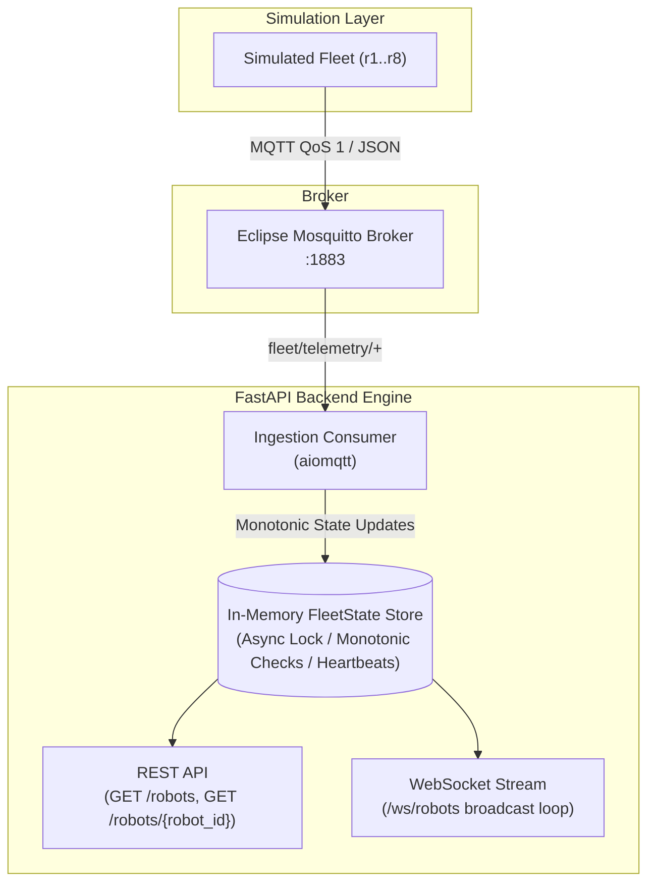

# Real-Time Fleet Telemetry Backend

This is the backend for a fleet management system — it listens to live telemetry from a simulated robot fleet over MQTT, keeps the current state of every robot in memory, and serves that state over both a REST API and a WebSocket stream. Built with FastAPI, `aiomqtt`, and Docker.

---

## How It Works



### A few things worth calling out

- **Thread-safe state store:** The in-memory fleet state uses `asyncio.Lock` with copy-on-read, so reads never block writes and callers can't accidentally mutate internal state.
- **Out-of-order protection:** If a telemetry frame arrives with a timestamp older than or equal to what's already stored, it gets dropped. This keeps the state consistent even when the network reorders packets.
- **Offline robot detection:** A background task checks every second and marks any robot that hasn't sent a heartbeat in more than 5 seconds as `offline`. This uses `time.monotonic()` so it's immune to system clock adjustments.
- **Reconnect logic:** If the MQTT broker goes away, the consumer retries with exponential backoff — starting at 1 second and capping at 30 seconds — rather than hammering the broker or crashing.
- **x86_64 / SELinux ready:** All Docker services are pinned to `linux/amd64`, and the Mosquitto volume mount uses the `:Z` flag so it works on Fedora/RHEL hosts with SELinux enforcing.

---

## Tech Stack

| Layer | Choice |
|---|---|
| Language | Python 3.13 |
| Package manager | `uv` |
| API framework | FastAPI + Uvicorn + Starlette WebSockets |
| MQTT client | `aiomqtt` (async) |
| Message broker | Eclipse Mosquitto |
| Testing | `pytest`, `pytest-asyncio`, `pytest-cov`, `httpx` |
| Orchestration | Docker Compose |

---

## Getting Started

**You only need Docker.** Everything else runs inside containers.

### Run the whole stack

This starts the Mosquitto broker, the FastAPI backend, and the 8-robot simulation — all in one go:

```bash
docker compose up --build -d
```

Check what's running:

```bash
docker compose ps
```

Tail the backend logs:

```bash
docker compose logs -f backend
```

---

## API

### REST

#### List all robots

```bash
curl -s http://localhost:8000/robots | jq
```

**Response (200 OK):**

```json
[
  {
    "robot_id": "r1",
    "x": 525.0,
    "y": 5.0,
    "battery": 55.8,
    "status": "idle",
    "t": 580.0,
    "last_seen_at": 9160.49
  }
]
```

#### Get a single robot

```bash
curl -s http://localhost:8000/robots/r1 | jq
```

#### Unknown robot ID

```bash
curl -s -i http://localhost:8000/robots/r99 | grep "404 Not Found"
```

### WebSocket

Connect to `ws://localhost:8000/ws/robots` and you'll receive a full fleet snapshot as a JSON array every 500ms.

```bash
uv run python -c "
import asyncio, websockets, json

async def stream():
    async with websockets.connect('ws://localhost:8000/ws/robots') as ws:
        for _ in range(3):
            data = await ws.recv()
            fleet = json.loads(data)
            print(f'Received broadcast frame with {len(fleet)} robots')

asyncio.run(stream())
"
```

---

## Local Development & Tests

```bash
# Clone and install
git clone <repo-url>
cd fleet-telemetry-backend
uv sync
```

The test suite covers 100% of the `app/` codebase (27 tests across state management, the MQTT consumer, the API routes, and the lifespan tasks):

```bash
uv run pytest --cov=app --cov-report=term-missing
```

---

## AI Delegation Notes

The core backend was written by hand. Here's a breakdown of what was AI-assisted and what wasn't.

### Written directly

- **System design:** The overall topology — MQTT as the transport, a single in-memory state store shared by both REST and WebSocket, background tasks for stale detection — was designed and laid out before any code was written.
- **Business logic:** `app/state.py` (the lock, the dictionary shape, copy-on-read), `app/consumer.py` (the subscribe loop and message routing), and `app/main.py` (route definitions and lifespan task management) were all authored directly.
- **Resilience details:** The monotonic timestamp rule, the exponential backoff reconnect, and the `last_seen_at` heartbeat timeout were each designed, implemented, and debugged by hand.
- **Integration fixes:** Worked through a Python 3.14→3.13 environment mismatch, a port conflict, Uvicorn module path scoping, and async task cleanup ordering on shutdown.

### Delegated to AI (Antigravity)

- **Test scaffolding (`tests/`):** Prompted Antigravity to generate the initial test fixtures across `conftest.py`, `test_api.py`, `test_consumer.py`, `test_state.py`, and `test_lifespan.py`. Reviewed the output to make sure mocking boundaries were correct (no real network calls during tests), checked that edge cases like timestamp rejection were covered, and verified the 100% coverage result.
- **Container config (`Dockerfile`, `docker-compose.yml`, `.dockerignore`):** Delegated the initial generation of these files, then hardened the output — adding `platform: linux/amd64` for the evaluation environment, `:Z` SELinux flags on volume mounts, healthcheck dependencies between services, and the correct `PYTHONPATH` for the robot module.

---

## Teardown

```bash
docker compose down
```
